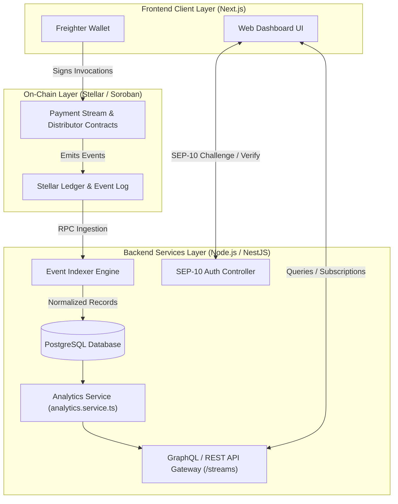
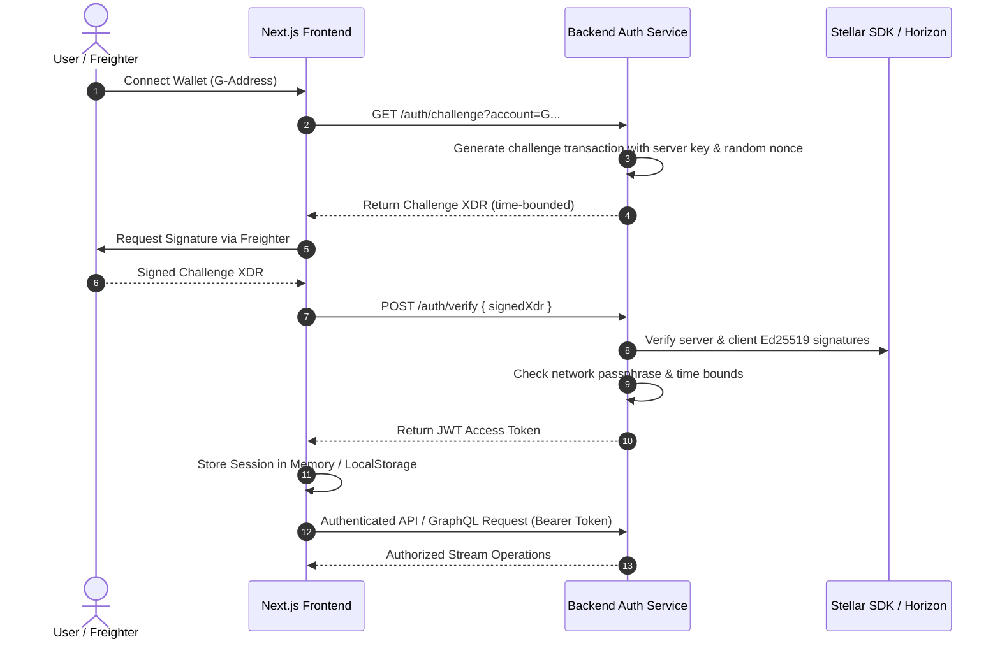

# System Architecture: End-to-End Data Flow & Protocols

This document provides the canonical architectural specification for the Azable protocol, establishing how the **Soroban Smart Contracts**, **Backend Indexer & Services**, and **Next.js Web Frontend** coordinate to power decentralized, streaming payroll and token distributions on Stellar.

---

## 1. High-Level System Topology

Azable connects on-chain streaming logic with responsive, real-time analytics dashboards through a loosely-coupled, event-driven pipeline:



---

## 2. Payment-Stream Event Ingestion & Dashboard Data Flow

When a user initiates or claims a payment stream on-chain, the transaction flows through the ingestion pipeline before appearing in real-time on the analytics dashboard:

```
[User / Freighter]
       │
       ▼ (1) create_stream() / withdraw()
[Soroban Smart Contract]
       │
       ▼ (2) Contract Event Emitted (topic: 'stream_created' / 'stream_withdraw')
[Stellar Core / Soroban RPC]
       │
       ▼ (3) Polled / Streamed via Indexer Engine
[Backend Indexer Service]
       │
       ▼ (4) Idempotent UPSERT into relational tables
[PostgreSQL Database (Prisma ORM)]
       │
       ▼ (5) Aggregated / Cached by `/streams` routes
[Analytics Service (analytics.service.ts)]
       │
       ▼ (6) Resolvers serve cached / structured payload
[GraphQL / REST Gateway]
       │
       ▼ (7) TanStack Query cache invalidation
[Next.js Dashboard UI]
```

### Flow Breakdown:
1. **Contract Execution**: The client triggers `create_stream()` on the Soroban payment contract, setting sender, recipient, token, start time, end time, and deposit amount.
2. **Event Emission**: The contract emits an immutable Soroban event containing the `stream_id`, timestamps, rates, and addresses.
3. **Ingestion & Indexing**: The backend indexer process polls the Soroban RPC `getEvents` endpoint, validates sequence order, and parses the XDR topics and values.
4. **Relational Persistence**: Events are normalized and written to PostgreSQL with strict idempotency (keyed on transaction hash + event index).
5. **Analytics & Aggregation**: `analytics.service.ts` updates computed metrics (total value locked, real-time streamed volume, claimed ratios).
6. **Delivery**: The Next.js frontend queries the GraphQL/REST API, rendering dynamic progress bars and streaming tickers in the UI.

---

## 3. SEP-10 Inspired Authentication Protocol

To protect private endpoints and multi-tenant stream metadata without centralized credentials, Azable implements a non-custodial cryptographic authentication flow inspired by SEP-10:



### Security Guarantees:
- **Replay Protection**: Every challenge transaction contains an ephemeral sequence number and narrow time boundary (valid for 5 minutes).
- **Network Isolation**: Signed transactions specify the target network passphrase (`Test SDF Future Network ; October 2022` or `Public Global Stellar Network ; September 2015`), preventing cross-network replay attacks.
- **Stateless Verification**: The backend issues a cryptographically signed JWT containing the verified Stellar public key and role permissions.

---

## 4. Subsystem Components & Responsibilities

| Subsystem | Directory | Primary Technology | Core Responsibility |
| :--- | :--- | :--- | :--- |
| **Smart Contracts** | `contracts/` | Soroban Rust SDK | Enforces streaming math, escrow balances, pause/cancel state, and token transfers. |
| **Backend Indexer** | `services/backend/` | NestJS, Prisma, PostgreSQL | Ingests ledger events, guarantees monotonic state persistence, and provides SEP-10 authentication. |
| **Web Frontend** | `apps/web/` | Next.js 14, Tailwind, Freighter | User interface for stream creation, real-time payment withdrawal, and organization analytics. |
| **Shared SDK** | `packages/sdk/` | TypeScript, `@stellar/stellar-sdk` | Contract bindings, XDR parsers, and reusable client helpers. |

---

## 5. Failure Modes & Resilience Patterns

- **Indexer Divergence**: If the backend indexer experiences RPC downtime, it resumes from the last indexed ledger sequence stored in the `IndexerSyncState` table.
- **Client Fallback**: If backend APIs are unreachable, the frontend SDK supports direct read-only RPC simulation to query contract stream states directly from Soroban persistent storage.
- **Transaction Rollback**: Soroban contract operations are fully atomic; failed token transfers or precondition violations abort the transaction and prevent partial storage commits.
