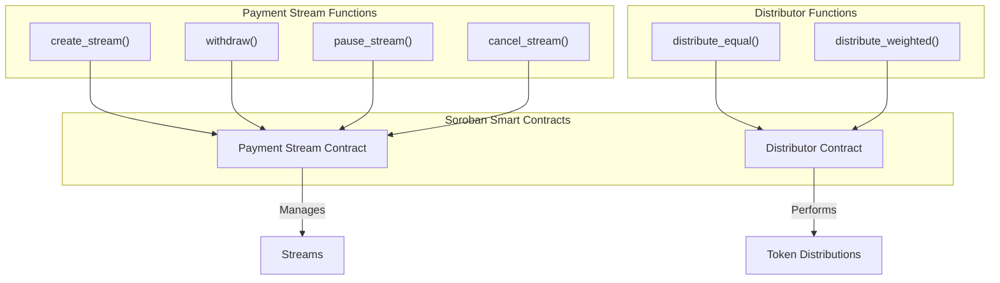

# Architecture

This document provides a high-level overview of the Azable Stellar project's architecture, which is composed of three main parts: a web frontend, a TypeScript SDK, and Soroban smart contracts.

## High-Level Architecture

The following diagram illustrates the interaction between the main components of the system:

```mermaid
graph TD
    A[User] --> B{Frontend (Next.js)}
    B <--> C{Backend (Node.js API)}
    B --> SDK{SDK (@azable/sdk)}
    C --> SDK
    SDK --> D{Soroban Smart Contracts}
    D --> E((Stellar Blockchain))
    B --> F[(IPFS - Decentralized Storage)]
    C --> F

    subgraph "Client-Side"
        A
        B
    end

    subgraph "Off-Chain / API"
        C
        SDK
    end

    subgraph "Decentralized Network"
        D
        E
        F
    end
```

### Components

-   **Frontend (Next.js):** The user-facing web application that allows users to interact with the Azable.
-   **SDK (@azable/sdk):** A TypeScript library that abstracts the communication with the Soroban smart contracts, providing a simple API for the frontend.
-   **Soroban Smart Contracts:** The on-chain logic that governs payment streams and token distribution.
-   **Stellar Blockchain:** The underlying blockchain where the smart contracts are deployed and transactions are recorded.

## Contract Architecture

The smart contract layer is composed of two main contracts, organized as a Cargo workspace.



### Contracts

-   **Payment Stream Contract:** Manages the lifecycle of payment streams, including creation, withdrawal, pausing, and cancellation.
-   **Distributor Contract:** Handles the distribution of tokens to multiple recipients, with support for both equal and weighted distributions.
